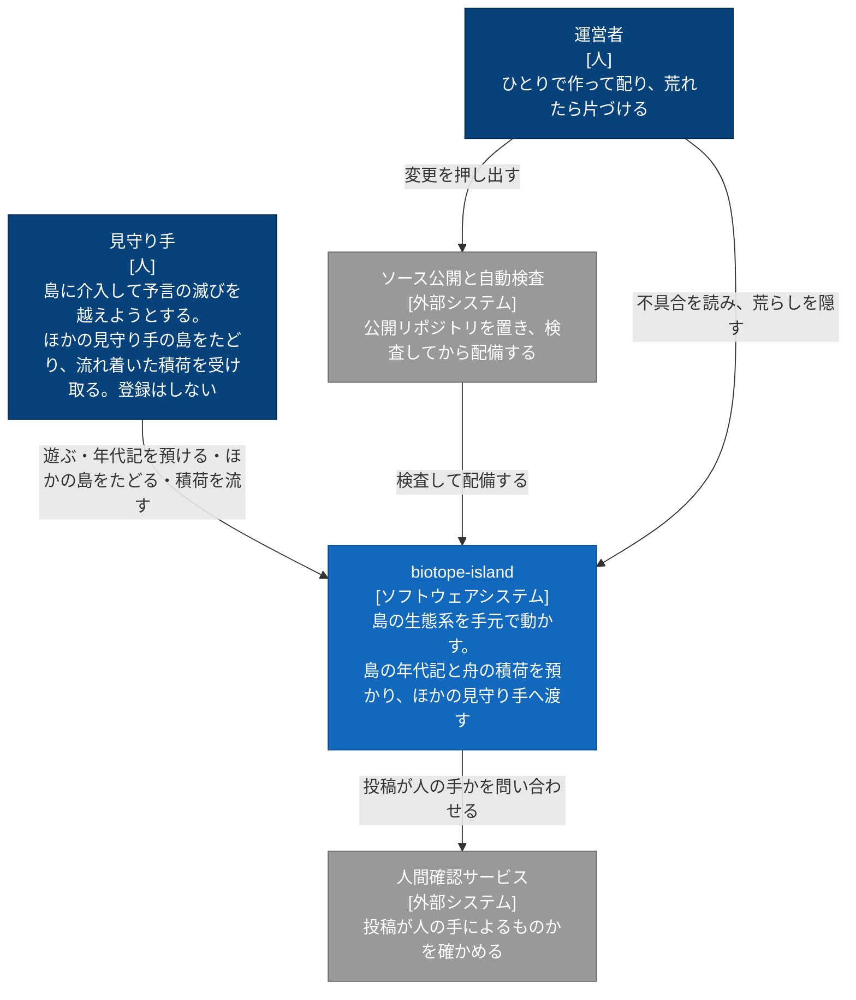
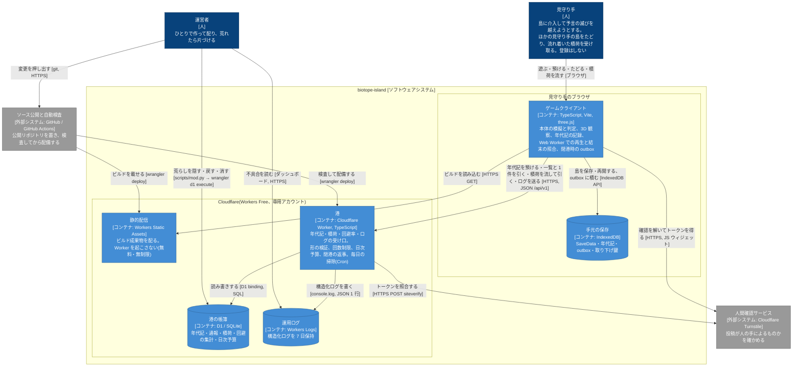

# 公開のアーキテクチャ(Cloudflare 無料枠、2026-09-26)

依頼(原文):「カジュアルな箱庭ゲームとしてフリーで公開し、お金のかからない cloudflare の workers とdatabaseメインで作りたい。アーキテクチャドライバを業務要件含めて取り出し、優先度をつけてin/outを制定。それをもとに具体的な技術スタックを選定してください。それをもとにC1とC2レベルの図を書いてください。mermaidで」

作り方: pstack の architect。2 つのモデル(opus・fable)がそれぞれ独立に 1 案ずつ作り、それを合成した。案の原文は作業用の scratchpad にある。Cloudflare の無料枠の数字は、2026-09-26 に docs で確かめた値を使い、出典を付けた。

## 結論

**島は手元で回し、港には年代記だけを預ける。**

- シミュレーションは今のまま、ブラウザで動かす。サーバーは tick を回さない。
- Cloudflare 側は Worker 1 本と D1 だけにする。この組を「港」と呼ぶ。
  - Worker は静的アセットと API を同じ 1 本で配る。
  - 港が預かるのは、島の**年代記**と**舟の積荷**。年代記は seed・予言・介入の時刻表で、数 KB。
- 見る側のブラウザが年代記を回し直し、結末が一致すれば「たどって確かめた」の印が付く。
- 静的アセットの配信は無料・無制限。無料枠を使い切った日も、閉まるのは港だけで、遊ぶことはできる。
- 超えると課金になる製品(R2)は構成に入れず、CI で検査して入らないようにする。

---

## 1. アーキテクチャドライバ

### 1.1 業務要件

| ID | 要件 | 優先度 | 根拠 |
|---|---|---|---|
| B1 | 誰でもブラウザで、登録なしですぐ遊べる | Must | カジュアルな箱庭をフリーで配る目的そのもの。登録の壁は離脱を生み、運営 1 人に個人情報の管理義務を生む |
| B2 | 自分の島を保存し、閉じても続きから遊べる | Must | 予言は 200〜500 年あり、1 回では終わらない。`World.serialize` という保存の器は本体にすでにある |
| B3 | 運営者が、配った先で起きた不具合と遊ばれ方を知れる | Must | M19-01/02。observability-first。運営 1 人では、ログが無いと直せない |
| B4 | 生き延びた島を「年代記」として預け、リンクで人に見せる。他人の島をたどって 3D 観察画面で見る | Should | 箱庭は見せ合うと寿命が延びる。無くてもゲームは成り立つ |
| B5 | 空の舟で逃がした積荷(種)が、ほかの見守り手の島へ流れ着く(島間の渡り・外来種) | Should | 設計書の空の舟(#5)・環がもたらす客(#20)・M14 がこれを前提にしている。世界観の中にある非同期の多人数要素で、代わりが無い |
| B6 | 予言ごとの回避率を見られる(「この予言を越えた見守り手は 12%」) | Could | バランス調整に効き、遊び手の手応えにもなる。B4・B5 が済めば、ついでに取れる |
| B7 | 運営は 1 人の趣味で、月 0 円 | Must | 依頼の前提 |

### 1.2 品質特性

| ID | 品質特性 | 優先度 | 根拠と測り方 |
|---|---|---|---|
| Q1 | **費用の上限が硬い**: 何があっても課金にならない | Must | 「止まるほうが良い、課金にしない」。超過が課金になる製品を構成から外し、CI で検査する(§3.3) |
| Q2 | **劣化の非対称**: 港が閉まっても、遊ぶ・保存するは止まらない | Must | 無料枠の天井は日次(UTC 0 時)に来る。天井に当たるとゲームが止まる設計は、毎日壊れる。E2E で API を全部閉じた状態で 1 シナリオ遊べることを確かめる |
| Q3 | **決定論**: 同じ版・同じ年代記は、誰のブラウザでも同じ結末になる | Must | 年代記の共有・検証・年表(M18)が全部これに乗る。固定の年代記の結末ダイジェストを CI で固定する(golden replay) |
| Q4 | 運用の手間: ふだんは月数分。荒れた日も 1 コマンドで片づく | Must | 管理画面は作らない。`wrangler d1 execute` を包んだ python スクリプト 1 本にする |
| Q5 | 匿名の投稿に耐える(荒らし・スパム・壊れた入力) | Must | アカウントを作らないので、形の検証・人間確認・回数制限・日次予算を重ねる(§6) |
| Q6 | 個人情報を持たない | Must | 公開リポジトリで、趣味の運営。生の IP・メール・自由文を保存しない |
| Q7 | 秘密をリポジトリに置かない | Must | MIT で公開済み。secret は `wrangler secret` と GitHub Secrets だけに置く |
| Q8 | 観察画面の性能予算(draw call ≤200・三角形 ≤1.5M・60 fps)を共有機能が食わない | Should | 再生は Web Worker(別スレッド)でする |
| Q9 | 試しやすさ: 契約は純粋関数、Worker はローカルの D1 で単体テストできる | Should | t-wada の TDD。単体テスト 716 件と同じ流儀 |

### 1.3 制約

| ID | 制約 | 出典 |
|---|---|---|
| C1 | Cloudflare の Workers Free だけで賄う。Workers と D1 を主軸にする | 依頼 |
| C2 | Worker の CPU は 1 呼び出し 10 ms。サーバーで本体を回して検証することはできない | [Workers limits](https://developers.cloudflare.com/workers/platform/limits/) |
| C3 | R2 は無料プランでも、超過すると課金になる(止まらない) | [R2 pricing](https://developers.cloudflare.com/r2/pricing/) |
| C4 | D1 は無料枠を超えるとクエリが失敗する(2026-09-01 から)。1 データベース 500 MB、1 行 2 MB | [D1 limits](https://developers.cloudflare.com/d1/platform/limits/)、[changelog](https://developers.cloudflare.com/changelog/post/2026-09-01-d1-free-tier-limit-enforcement/) |
| C5 | 本体は版の中でだけ決定論的。係数を変えると、過去の年代記の結末が変わる | コード。年代記に `simVersion` を刻む |
| C6 | **今の本体はフレームの刻みに依存する**(下の注) | `src/core/runner.ts`・`src/scenario/ScenarioRunner.ts`・`src/main.ts` |
| C7 | 既存の型に合わせる: `LogSink`/`LogRecord`、`Command`、`SaveData`、`World.dispatch`、`ScenarioRunner.intervene`、`src/ui/clicks.ts`(台本と UI が同じ入口) | コード |
| C8 | Workers と D1 の日次の枠はアカウント単位 | pricing。このゲーム専用の Cloudflare アカウントを使う |

C6 の注(opus の案が見つけ、コードで確かめた):
- `core/runner.ts` は 1 フレームで最大 200 tick 進める(`world.step(Math.min(ticks, cap))`)。
- `ScenarioRunner.update`(`fireDue(year)` で予定の滅びを出し、年の境目で予算を動かす)は、`main.ts` の onTick からフレームごとに 1 回しか呼ばれない。
- そのため、予定コマンドが本体に入る tick が、速度とフレームの間隔で変わる。このままでは、同じ seed と同じ介入でも結末が一致するとは限らない。
- 年代記の共有の前に、「1 回の step で年の境目を越えない」修正と golden replay のテストが要る。

---

## 2. スコープ

### 2.1 In(今回作る)

| # | 作るもの | 満たす要件 |
|---|---|---|
| 1 | **決定論の刻みの修正**: 1 回の step が年の境目を越えないようにする。golden replay のテストを付ける | Q3・C6(ほかの全部の前提) |
| 2 | 静的配信: 今のビルドを Workers Static Assets で配る。`.blend` と `textures/concept/**` は配らない | B1 |
| 3 | 手元の保存: SaveData と年代記を IndexedDB に置く(自動保存と手動の枠)。サーバーは関わらない | B2 |
| 4 | 年代記の記録: UI の `dispatch` の外側で、tick 付きの命令を積む。本体は変えない | B4・Q3 |
| 5 | HTTP LogSink(M19-01)とログの受け口(M19-02)。warn/error と年ごとの要約だけを送る。受けたログは Workers Logs(7 日)に書き、D1 には入れない | B3 |
| 6 | 港の API: 年代記の出港・一覧・1 件・通報・取り下げ | B4 |
| 7 | 訪問者の再生の照合: Web Worker で年代記を回し直してダイジェストを比べ、確認と不一致の数を積む | B4・Q2 |
| 8 | 舟の積荷: 積荷を流す、漂着をランダムに 1 件引く。受け取るかは UI で選ばせ、受け取ったら外来種として `dispatch` する(年代記に載る) | B5 |
| 9 | 閉港の劣化: 出港は IndexedDB の outbox に入り、翌日に同じ id で再送する | Q2 |
| 10 | 無料枠を超えない仕組み: アプリの日次予算・人間確認・回数制限・CI の構成検査・専用アカウント | Q1・Q5 |
| 11 | 運用スクリプト `scripts/mod.py`(隠す・戻す・消す・予算を見る) | Q4 |

### 2.2 Out(作らない)

| 作らないもの | 理由 |
|---|---|
| アカウント・ログイン・メール | B1・Q6。取り下げの権利は、出港時に返す取り下げ鍵で足りる |
| クラウド保存(SaveData をサーバーへ) | 1 件は gzip 前で推定 1〜3 MB。D1 の 1 行 2 MB・1 データベース 500 MB にかかる。R2 は課金になる(C3)。年代記なら数 KB で済む |
| サーバー側の島(Durable Objects で tick を回す) | CPU 10 ms(C2)。本体はブラウザで 60 fps で動いていて、二重化は運営 1 人の負債になる。無料枠を超えた日にゲームまで止まる(Q2 違反) |
| サーバー側の検証再生 | C2。検証は訪問者のブラウザがする |
| ランキング・いいね | 検証できない数で順位を付けると、改ざんと票の荒らしを呼ぶ。「確認の印」と回避率までにする |
| 自由文(島の名前・コメント・チャット) | 1 人ではモデレーションできない。島の名前は seed から作り、ひとことは決まった碑文から選ばせる |
| リアルタイムの多人数(WebSocket) | 漂着は非同期で世界観に合う。趣味の規模には重い |
| R2・KV・Queues | R2 は超過で課金(C3)。KV は書き 1,000/日で一覧も引けない。Queues は 10,000 操作/日で、ログより先に尽きる |
| サムネイル画像 | 置き場に R2 が要る。年ごとの個体数の短い系列を年代記に添え、クライアントが折れ線で描く |
| 版をまたいだ島の再生 | C5。旧版の年代記は「要約だけ」を見せる。スナップショットを置く案は §8 の未決事項に回す |
| 独自ドメイン・Web の管理画面・課金・寄付ボタン | 費用と攻撃面が増える。`*.workers.dev` で配り、運営は CLI で行う |

---

## 3. 技術スタック

### 3.1 層ごとの選定

| 層 | 選定 | 理由 | 落選 |
|---|---|---|---|
| クライアント | 今のまま: TypeScript・Vite 8・three.js・simplex-noise。足すのは `src/harbor`(契約と港のクライアント)、`src/chronicle`(記録と再生)、`src/persist`(IndexedDB) | 変えない | — |
| 再生 | ブラウザの Web Worker で本体を回す | 数百年の再生で画面を止めない。壊れた年代記を渡されても、tick の上限と中断でタブを守れる | メインスレッド |
| 手元の保存 | IndexedDB(`saves`・`chronicle`・`outbox`・`keys`) | localStorage は 5 MB 前後で、SaveData を複数持てない | localStorage |
| 静的配信 | **Workers Static Assets**(API と同じ Worker に同梱)。SPA の fallback は `assets_navigation_prefers_asset_serving`(2025-04-01 から既定)で Worker を起こさない | 静的アセットへのリクエストは無料・無制限 | Cloudflare Pages(新規は Workers へ寄せる流れ。1 回の deploy で配信と API を出せるほうが手間が少ない)、GitHub Pages(Cloudflare 主軸の指示に反する) |
| API(港) | **Cloudflare Worker 1 本**、TypeScript、フレームワークなし(ルート表 1 枚)。`/api/*` だけ fetch handler に入る | ルートは 10 本ほど。依存を増やさない今の流儀に合わせる。枠はアカウント単位なので、Worker を分けても枠は分かれない | Hono(8〜10 ルートに対して重い) |
| データベース | **D1**(SQLite)。港の帳簿(年代記・通報・積荷・回避の集計・日次予算) | 新しい順の一覧・ランダムに 1 件・集計の加算が SQL 1 文で書ける。超えるとクエリが失敗するだけで、課金にならない | KV、Durable Objects SQLite(この規模では D1 1 つで足り、置き場が 2 つになる。リアルタイムの多人数を始めるときの候補) |
| 契約 | 手書きのパーサー `src/harbor/contract.ts` をクライアントと Worker が同じファイルで import する | 型と検証を 1 か所に置く | zod |
| ログ | **Workers Logs**(`console.log` に JSON を 1 行) | 無料プランに含まれ、7 日保持。D1 の書き枠を使わない | Analytics Engine(無料での枠を確かめていない)、Logpush(有料) |
| 人間確認 | **Turnstile**(出港と通報だけ) | 無料。siteverify は Worker から外への subrequest 1 回 | reCAPTCHA(外部依存・個人情報) |
| 回数制限 | **Rate Limiting binding**(送り手のハッシュごと)。**使えなくても成り立つ**ようにし、最後の砦は D1 の日次予算にする | GA(2025-09-19)。無料プランで使えるかは docs に記載が無い(要確認) | D1 だけで数える(書きが倍になる) |
| 定期処理 | 同じ Worker の `scheduled`(Cron 1 本、毎日) | 古い積荷・隠した記録・予算行の掃除と、保存量の集計 | — |
| テスト | vitest(契約・記録・再生)、`@cloudflare/vitest-pool-workers`(Worker とローカル D1)、Playwright(`page.route()` で API を決定論的にモック。API を全部閉じた状態でも遊べるかの E2E) | テスト品質ルールに合わせる | — |
| 配備 | **GitHub Actions**(`lfs: true` で checkout → check と golden replay → `vite build` → `wrangler deploy`)。API トークンは GitHub Secrets | glb・png は git LFS。Cloudflare の Git 連携ビルドが LFS を引くかは未確認 | Cloudflare の Git 連携ビルド |
| 運用 | `scripts/mod.py`(中身は `wrangler d1 execute --remote`) | 定型作業は python スクリプトにする | Web の管理画面 |

### 3.2 無料枠と見積もり

想定: ふだん 300 DAU、SNS で話題になった日に 3,000 DAU。1 人 1.3 セッション、1 セッションあたり Worker の呼び出しは約 3.8 回(一覧 1.5・1 件 0.5・回避率 0.5・回避の報告 0.5・出港 0.1・積荷 0.15・ログのバッチ 0.5)。静的アセットは数えない。

| 資源 | 無料枠(docs で確認) | 3,000 DAU の日 | 余裕 | 出典 |
|---|---|---|---|---|
| Workers のリクエスト | 100,000/日(UTC 0 時に戻る) | 約 15,000 | 約 6.7 倍。約 20,000 DAU で天井 | [limits](https://developers.cloudflare.com/workers/platform/limits/) |
| Workers の CPU | 10 ms/呼び出し | 推定 1〜3 ms(16 KB 以下の JSON の parse と sha256) | 3 倍以上 | 同上 |
| 外への subrequest | 50/呼び出し | 1(siteverify) | — | 同上 |
| 静的アセット | リクエスト無料・無制限。1 版 20,000 ファイル、1 ファイル 25 MiB | — | dist 16 MB(concept を外すともっと小さい) | [pricing 脚注 3](https://developers.cloudflare.com/workers/platform/pricing/)、[limits](https://developers.cloudflare.com/workers/platform/limits/#static-assets) |
| D1 の行の読み | 5,000,000/日 | 約 25 万行(一覧 1 回 約 25 行、索引つき) | 約 20 倍 | [pricing#d1](https://developers.cloudflare.com/workers/platform/pricing/#d1) |
| D1 の行の書き | 100,000/日 | 約 4,200 行 | 約 24 倍。アプリの日次予算で最悪でも約 4.3 万行に抑える(§6) | 同上 |
| D1 の保存 | 1 データベース 500 MB、アカウント合計 5 GB、1 行 2 MB、1 呼び出し 50 クエリ | 年代記 1 件 多くても 10 KB。4 万件で約 400 MB | 400 MB で内部の栓(§6) | [D1 limits](https://developers.cloudflare.com/d1/platform/limits/) |
| Workers Logs | 無料プランに含む、7 日保持 | 1 日 数千件 | — | [Workers Logs](https://developers.cloudflare.com/workers/observability/logs/workers-logs/) |
| Turnstile | 無料、1 アカウント 20 ウィジェット。トークンは 300 秒・1 回きり、siteverify 必須 | 1 ウィジェット | — | [Turnstile plans](https://developers.cloudflare.com/turnstile/plans/) |
| Cron | 5 本/アカウント | 1 本 | — | limits |

### 3.3 「課金にしない」を構造で守る

`scripts/check_free_tier.py` を CI の check に入れ、次のどれかがあれば落とす。

- `wrangler.jsonc` に、この設計で使わない binding(`r2_buckets`・`queues`・`analytics_engine_datasets`・`browser`・`ai` など)がある
- 有料の usage model を指している
- `.assetsignore` に `*.blend` と `textures/concept/**` が無い
- 配る dist のファイル数が 20,000、または 1 ファイルが 25 MiB を超える

運用の決まり:
- アカウントには支払い方法を登録しない。Workers Paid に上げる操作は、この設計の外で人が決める。
- ほかの Worker と枠を食い合わないよう、このゲーム専用の Cloudflare アカウントを使う(C8)。

---

## 4. C4 図

mermaid の `flowchart` で描く。`C4Context` と `C4Container` の記法は実験扱いで、配置を指定できず、日本語の長いラベルが重なりやすい。そこで classDef で C4 の色分けをまねる。

図の決まり:
- C1 には技術名を置かない。
- C2 の人と外部システムの名前は、C1 と同じにする。
- 線には動詞を書き、C2 ではプロトコルも添える。

### 4.1 C1: System Context



### 4.2 C2: Container



C2 の補足:
- 「静的配信」と「港」は、実際には 1 回の `wrangler deploy` で出る同じ Worker の 2 つの顔。数え方と課金が違う(静的配信は無料・無制限、港は 100,000/日)ので、コンテナを分けて描いた。
- Rate Limiting binding は港の中の仕組みなので、図には描かず港の説明に入れた。
- 再生の Web Worker も同じで、ゲームクライアントの中に含めた(独立して配備しない)。

---

## 5. 形の要点

### 5.1 共有の単位は年代記

| 型 | 中身 | 大きさ | 役目 |
|---|---|---|---|
| `Chronicle`(年代記) | `simVersion`・`scenarioId`・`seed`・`commands: {tick, command}[]`・年ごとの個体数の短い系列 | 8〜16 KB まで(parse で検査) | 島が「なぜそうなったか」の原因。年表・再生・照合の唯一の真実 |
| `Digest`(結末の要約) | 年・判定(alive/dead)・種ごとの総数(`toPrecision(6)`)・絶滅した種と、その正規化 JSON の SHA-256 | 数百 B | 照合の一点比較。版違いの島にはこれだけを見せる |
| `Cargo`(積荷) | 種 id(カタログのみ)と量、1〜5 件 | 数百 B | 渡り。受け取り側は外来種として `dispatch` する |

設計の決め事:
- **年代記の id は、正規化した年代記の SHA-256 にする。** 同じものを 2 回出港しても 1 件にしかならない。outbox の再送もこれで冪等になる。一覧の並びは `published_at` の索引で作る。
- **書き手が重ならないようにする。** 1 件の行に書くのは、作者(出港・取り下げ)と訪問者(確認・通報のカウンタの加算)だけ。加算は可換なので、同時に書いても何も起きない。
- **境界で一度だけ検証する。** Worker の入口で `parse*(unknown) → Parsed<T>` を純粋関数でかける。クライアントも出港前に同じ関数を呼び、同じ拒否理由を先に出す。wire 型と D1 の行は `harbor/wire.ts` に閉じる。
- **港のクライアントは深く作る。** `createHarbor` は例外を投げず、`published | queued | closed | slow_down | not_human | rejected` の形で返す。人間確認・閉港の読み替え・outbox・再送・取り下げ鍵の保管は、その裏に隠す。

### 5.2 型の素描(`src/harbor/contract.ts`、クライアントと Worker が共有)

```ts
export type ChronicleId = string & { readonly __brand: 'ChronicleId' }; // 正規化 JSON の SHA-256
export type SimVersion = string & { readonly __brand: 'SimVersion' };   // ビルド時に焼く。本体の係数が変われば上げる

/** 見守り手が dispatch した命令。予言が出す命令(fromStar:false)は含めない(再生時に同じ ScenarioRunner が再現する) */
export type TimedCommand = { tick: number; command: Command };

export type Chronicle = {
  simVersion: SimVersion;
  scenarioId: string;                  // カタログのキー。自由文ではない
  seed: number;
  commands: readonly TimedCommand[];   // 不変条件: tick は単調非減少、長さ ≤ 4000
  yearly: readonly Readonly<Record<string, number>>[]; // 年ごとの種の総数(折れ線用、間引き済み)
};

export type Digest = {
  year: number;
  verdict: 'alive' | 'dead';
  totals: Readonly<Record<string, number>>;
  extinct: readonly string[];
  hash: string;                        // 上の正規化 JSON の SHA-256。比較はこれ 1 つ
};

export type ParseError = { path: string; reason: string };
export type Parsed<T> = { ok: true; value: T } | { ok: false; error: ParseError };

export function parseChronicle(input: unknown, limits: Limits): Parsed<Chronicle> { throw new Error('not implemented'); }
export function parseCargo(input: unknown, catalog: ReadonlySet<string>): Parsed<Cargo> { throw new Error('not implemented'); }
export function chronicleId(c: Chronicle): Promise<ChronicleId> { throw new Error('not implemented'); }
export function digestOf(snapshot: WorldSnapshot, verdict: Digest['verdict']): Promise<Digest> { throw new Error('not implemented'); }
```

```ts
// src/harbor/client.ts — 呼び手は kind で分けるだけ
export type PublishResult =
  | { kind: 'published'; id: ChronicleId; url: string }
  | { kind: 'queued' }                        // 閉港・オフライン。outbox に入り、次回起動と 1 時間ごとに同じ id で再送
  | { kind: 'not_human' | 'slow_down' }       // 人間確認の失敗・回数制限
  | { kind: 'rejected'; reason: string };     // 契約違反・版違い・満杯。再送しない

export type Harbor = {
  publish(c: Chronicle, d: Digest): Promise<PublishResult>;
  withdraw(id: ChronicleId): Promise<'ok' | 'closed' | 'forbidden'>;   // 手元の取り下げ鍵で
  browse(q: { scenarioId?: string; before?: string }): Promise<{ kind: 'ok'; cards: ChronicleCard[] } | { kind: 'closed' }>;
  visit(id: ChronicleId): Promise<{ kind: 'ok'; chronicle: Chronicle; card: ChronicleCard } | { kind: 'closed' | 'missing' }>;
  confirm(id: ChronicleId, d: Digest): Promise<void>;                  // 失敗は握りつぶす(照合は善意の付加物)
  report(id: ChronicleId): Promise<'ok' | 'closed'>;
  castCargo(c: Omit<Cargo, 'id'>): Promise<'ok' | 'queued' | 'rejected'>;
  drawCargo(): Promise<{ kind: 'ok'; cargo: Cargo | null } | { kind: 'closed' }>; // 漂着をランダムに 1 件
  reportOutcome(scenarioId: string, verdict: Digest['verdict']): Promise<void>;   // 回避率
  avoidanceRate(scenarioId: string): Promise<number | null>;
};

export function createHarbor(deps: { baseUrl?: string; store: IslandStore; simVersion: SimVersion; fetch?: typeof fetch; turnstile?: () => Promise<string> }): Harbor { throw new Error('not implemented'); }
// baseUrl が無ければ「常に閉港」の実装になる(ローカル開発と E2E の既定)
```

```ts
// src/chronicle/recorder.ts — World は変えない。UI の dispatch を外から包む
export function recordChronicle(world: DispatchLike, head: Pick<Chronicle, 'simVersion' | 'scenarioId' | 'seed'>):
  { dispatch: DispatchLike['dispatch']; current(): Chronicle; resume(saved: Chronicle): void } { throw new Error('not implemented'); }

// Web Worker から呼ぶ。同じ版なら同じ Digest を返す。tick の上限と中断を持つ
export function replay(c: Chronicle, onYear?: (year: number) => void, signal?: AbortSignal): Promise<Digest> { throw new Error('not implemented'); }
```

### 5.3 やらないこと

- サーバーは tick を回さない。
- ランキングを作らない。
- 自由文を受けない。
- SaveData を預からない。
- ログを D1 に入れない。
- R2 を使わない。

---

## 6. 無料枠を超えたときと、濫用対策

### 6.1 自分で先に止まる

2026-09-01 から、D1 は上限に当たると読みも含めてクエリが失敗する。その手前で、港が自分から閉まる。

- D1 の `daily_budget` に、その日の出港・積荷・通報の件数を数える。上限は仮に、出港 2,000、積荷 5,000、通報 1,000。これで D1 の書きは最悪でも約 43% に収まる。
- 捨てる順は、ログ > 確認 > 一覧 > 積荷 > 出港 > 訪問。共有リンクの訪問は最後まで守る。
- `/logs` と `/confirm` は、入口で粗い日次上限を持つ。超えた分は 204 を返して黙って捨てる。M19-01 の「失敗しても本体は止まらない」を満たす。
- D1 の保存が 400 MB を超えたら、出港を「港は満杯」で閉じる。1 データベース 500 MB の内側に置く栓で、保存量は Cron が毎日集計する。古い記録は運営が CLI で間引く。

### 6.2 何が尽きたら、何が起きるか

| 尽きたもの | 港の振る舞い | 見守り手に見えるもの |
|---|---|---|
| Workers 100,000/日 | 1027。API のルートは fail closed(静的アセットは別の経路で無料・無制限) | 「港は今日は閉まっている」。出港は outbox へ入って翌日に再送。**遊ぶ・保存するは動く** |
| D1 の書き 100,000/日 | 出港・確認・通報・積荷が closed | 一覧と訪問は動く |
| D1 の読み 5M/日 | 一覧・訪問も closed | ゲームは動く |
| D1 の保存(内部の栓 400 MB) | 出港だけ「満杯」 | 訪問は動く |
| 人間確認の失敗 | 422 | 「もう一度」 |
| 回数制限 | 429 | 「しばらく待って」 |

クライアントは 1027・503・ネットワークの失敗を、同じ `closed` に読み替える。閉港はエラーではなく普段の状態として、UI に言葉を持たせる。

不変条件: **`main.ts` は、静的アセット以外のネットワークに頼らずに起動し、遊べる。**

### 6.3 濫用対策(匿名の投稿と共有の荒らし)

| 攻撃 | 対策 |
|---|---|
| 大量投稿で枠を枯らす | 人間確認(出港と通報)、回数制限、日次予算、payload の上限(`Content-Length` を先に見る) |
| 文字による荒らし | **自由文を受けない**。名前は seed から作る。予言・種・碑文はカタログの id だけ受ける |
| 画像による荒らし | 画像を受けない。折れ線は年代記の系列からクライアントが描く |
| 偽の「Alive」 | 訪問者の再生で照合し、不一致の数も表示する。順位を作らないので動機が薄い |
| 壊れた年代記で訪問者のタブを落とす | parse の不変条件で弾く。再生は Web Worker の中で、tick の上限と中断を持つ |
| 積荷で他人の島を壊す | 1〜5 件、量は (0, 10]、種はカタログのみ。受け取るかは UI で選ばせる。受け取れば本体の `dispatch` の門を通り、年代記に載る |
| 通報の悪用 | 通報にも人間確認と回数制限をかける。3 件で自動的に隠し、運営が CLI で戻せる |
| 他人の島の取り下げ | 出港時に返す取り下げ鍵(D1 にはハッシュだけ)を持つ人だけができる |
| 回数制限のための送り手の識別 | IP は保存しない。日付ごとに salt を変えた HMAC でハッシュにし、その日の数えにだけ使う |

---

## 7. 合成の判断

2 つの案は、結論の形では独立に一致していた。
- 島はブラウザに置く。港は Worker と D1。
- R2 と KV は落とす。
- 自由文とランキングは作らない。
- 照合は訪問者の再生でする。

違ったのは、次の 3 点。

| 論点 | opus の案 | fable の案 | 採ったもの |
|---|---|---|---|
| 預けるもの | 年代記(台本)だけ | 年代記と、SaveData の gzip(約 0.5 MB の BLOB) | **年代記だけ**。D1 は 1 データベース 500 MB・1 行 2 MB(docs で確認)なので、スナップショットを置くと約 1,000 島で満杯になる。版違いの島の訪問は、今回はあきらめて要約を見せる(§8-2) |
| 作者の権利 | 出港時に返す取り下げ鍵 | ブラウザの鍵(ECDSA P-256)で署名 | **取り下げ鍵**。署名は Safari の対応確認と鍵のエクスポートが要り、1 人運営には重い |
| 積荷の宛先 | 漂着をランダムに 1 件引く(身元不要) | 港が隣島を選び、署名付きで受け取る | **ランダムに引く**。身元の仕組みが要らない |

土台は **opus の案**にした。決め手は次の 3 つ。
- 公開面が小さい(預ける塊が数 KB)。
- 決定論の前提の穴(C6)を見つけ、それを最初の一歩にしている。
- 「課金にしない」を CI の構成検査で構造にしている。

fable の案から取り入れたもの:
- 閉港時の outbox(翌日に同じ id で再送)
- 捨てる順の優先度(訪問を最後まで守る)
- 「年代記」という名前(琥珀・石板の年表 M18 とつながる)
- `recordChronicle` で UI の `dispatch` を外から包む記録点
- 「`main.ts` は静的アセット以外に頼らず起動する」の不変条件

### 受け入れたトレードオフ

- **同時に居る体験は捨てる。** 代わりに、無料枠の消費が予測できる。渡りも訪問も非同期にする。
- **「Alive」の照合は、訪問者の善意に任せる。** 代わりに、サーバー側の再計算は要らない。偽物は不一致の数として見える。
- **スナップショットは預けない。** 代わりに、容量は 1/50 で済む。本体の版が上がると、過去の年代記は要約だけになる。
- **島に名前を付けさせない。** 代わりに、モデレーションを人手にしない。
- **アカウントを作らない。** 代わりに、取り下げ鍵を失うと自分の島を取り下げられない。通報で隠れるので、実害は「消せない」より「消される」に寄る。
- **ログは 7 日しか残さない。** 長期に残るのは回避率の集計だけで、再現は年代記で足りる。

### 他の案(落選)

- **静的 SPA と、D1 に薄い CRUD(SaveData をそのまま預ける)。** 公開面は小さいが、隠す複雑さも無い(浅いモジュール)。SaveData は 1 行 2 MB・1 データベース 500 MB にかかる。照合・年表・渡りの土台が無く、後から年代記を足すと、保存の真実が 2 つになる。
- **Durable Objects に島 1 つずつ(サーバーで tick を回す)。** DO は無料プランで課金されず、金の面では成り立つ。しかし CPU 10 ms では数 tick しか進まない。本体の二重化は運営 1 人の負債になる。無料枠を超えた日にゲームが止まる(Q2 違反)。
- **完全 P2P(WebRTC)。** 発見にサーバーが要り、「あとで誰かに届く」非同期の渡りが作れない。

---

## 8. 未決事項とリスク

1. **決定論の刻み(C6)の直し方**。「1 回の step で年の境目を越えない」で十分か。予言の卒業(#30)などの乱数が、すべて seed から来ているか。golden replay で確かめる。
2. **版違いの島**。本体の係数を変えるたびに、過去の年代記は「要約だけ」になる。旧版のビルドを `/v/<n>/` に残して、そこで再生する案は Could として保留する。静的アセットは 1 版 20,000 ファイルなので、版ごとのビルドの大きさを見てから決める。
3. **再生の所要時間**。300 年の再生がブラウザで何秒かかるか(tests/slow から、1 件あたり数十秒と推定)。照合を自動で走らせるか、「年表を読む」の明示操作にするか。
4. **Rate Limiting binding が無料プランで使えるか**。docs に記載が無い。使えなければ D1 の日次予算だけで締める(設計はそれで成り立つ)。
5. **fail open と fail closed**。fail open は「Worker が無いものとして振る舞う」とあるが、Static Assets 付きの Worker で API のパスがどう返るかは未確認。配備後に確かめる。
6. **Cloudflare の Git 連携ビルドが LFS を引くか**。引かなければ GitHub Actions で確定。どちらでも設計は変わらない。

## 9. 次の一手

1. 決定論の刻みを直し、golden replay(固定の seed と介入 → 結末のダイジェストが一致)を vitest で 1 本通す。
2. そのうえで `contract.ts` の `parseChronicle`・`digestOf` と `recordChronicle` を TDD で書く。

Cloudflare に触れるのは、「同じ年代記は同じ島になる」がテストで示せてから。

## 10. チケット

in のスコープは issues/M19-04〜12 に起こした(既存の M19-01・02 は方針を追記)。順は issues/README.md の「進める順」。

| 設計書の in | チケット |
|---|---|
| 1 決定論の刻み | M19-04 |
| 2 静的配信 | M19-02 |
| 3 手元の保存 | M19-05 |
| 4 年代記の記録 / 7 照合 | M19-06(記録・再生)、M19-07(契約)、M19-09(照合の UI) |
| 5 LogSink とログの受け口 | M19-01・M19-02 |
| 6 港の API / 9 閉港の劣化 | M19-08(Worker と D1)、M19-09(クライアントと outbox) |
| 8 舟の積荷 | M19-10 |
| B6 回避率 | M19-11 |
| 10 課金にしない仕組み / 11 運用スクリプト | M19-12 |
