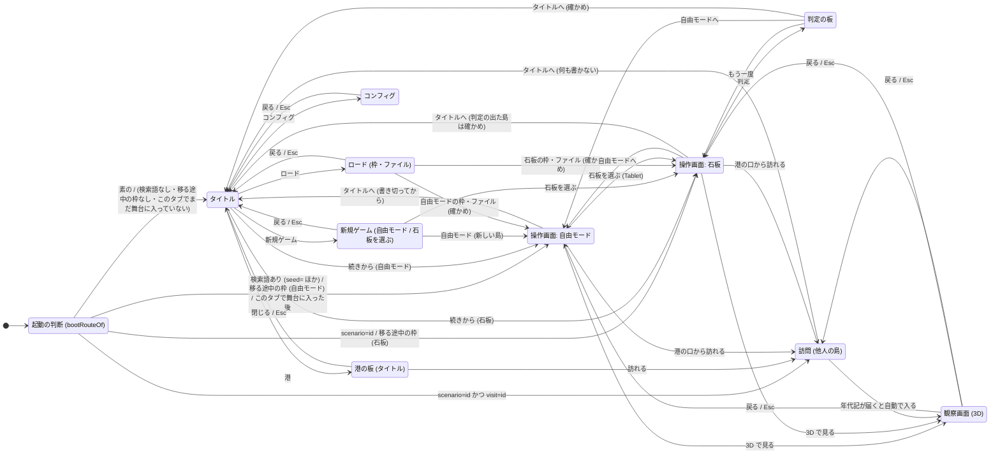

# タイトル画面の画面遷移図 (M24-00)

- 票: `issues/M24-00-title-ux-design.md`。この図の上に M24-01 (タイトル画面)・M24-02 (メニュー)・M24-03 (石板の選択と港) が立つ
- 元にした作り: feat/m24 a23bb27 (feat/m19 fc409cc を取り込んだもの)。feat/m19 はまだ main に入っていない
- 状態: 案。ユーザーの承認の前。下の「決めること」は案と推しを並べただけで、まだ決まっていない
- W/F: `wireframes/*.svg` (灰の濃淡だけのロー・フィデリティ)。読み方は `README.md`

## いまの起動 (2026-10-04 の作り)

起動するといきなり操作画面が開く。どの舞台で開くかは URL と置き場が決める。

| URL (検索語) | 開く舞台 | 決める所 |
|---|---|---|
| 無し (`/`) | 自由モード。自動の枠に続きがあれば続きから、無ければ seed 42 の島 | `bootPlanOf` の restore `auto`、`DEFAULT_SEED` |
| `seed=<n>` | 自由モード。その seed の島の続きだけを戻し、無ければその seed の新しい島 (M26-10) | `bootSeedOf`・`seedMatches` |
| `scenario=<id>` | その石板。途中の島があれば続きから (M19-14)、判定の出た石板は初めから。`seed=` は落とす | `bootPlanOf`・`resumeScenario` |
| `scenario=<id>&visit=<id>` | 他人の島の訪問。手元に何も書かない | `bootPlanOf` の `visitIdOf` |
| `visit=` だけ | 自由モード (石板の無い訪問は組めない) | `visitIdOf` |
| `scenario=<知らない id>` | 自由モード。URL から `scenario` と `visit` を消す (M19-17) | `bootPlanOf` の unknown |
| `player=`・`dev=1`・`paused=1`・`clock=`・`shortcut=alive`・`acceptance=` | 舞台は変えない。開発と受入のビルドだけが読む修飾 (M19-16・M25-02) | `src/dev/session.ts` |

ほかに、違う舞台の枠を読むために移ってきたときは、sessionStorage の「移る途中の枠」(`takePendingSlot`) が URL より先に効く (M19-17 §4)。
石板の中の「自由モードへ」と判定の板の「自由モードへ」は、検索語の無い `/` へ移る (`searchFor` が `scenario` を消し、自由モードの seed は `/` に乗っていない)。

## 遷移図

新しいものは、起動の判断の `Title` 側・タイトルとその下の 4 つの板・各舞台の「タイトルへ」。
ほかの矢印 (石板を選ぶ・自由モードへ・もう一度・訪れる・3D で見る) はいまの作りのまま。
観察画面からタイトルへは直に行かない。いったん操作画面へ戻ってから「タイトルへ」を押す (観察画面の帯の札を増やさない)。

## 画面ごとの目的・入口・出口・戻り道

| 画面 | 目的 | 入口 | 出口 | タイトルへの戻り道 | W/F |
|---|---|---|---|---|---|
| タイトル | 何の遊びかを 1 画面で伝え、次の 1 手を 1 つ選ばせる | 素の `/`、各舞台の「タイトルへ」 | 続きから・新規ゲーム・ロード・港・コンフィグ | (ここ) | `title-*.svg` |
| 新規ゲーム | 自由モードか石板かを選び、石板なら予言を読んでから始める | タイトルの「新規ゲーム」 | 自由モードの操作画面、石板の操作画面 | 戻る・Esc | `new-game-*.svg` |
| ロード | 手元の枠 (自動の枠を含む) とファイルから、元の舞台で開く | タイトルの「ロード」 | 包みの舞台の操作画面 (確かめの後) | 戻る・Esc | `load-*.svg` |
| コンフィグ | 起動をまたいで残す好みを変える | タイトルの「コンフィグ」 | タイトル (値はその場で保存) | 戻る・Esc | `config-*.svg` |
| 港の板 (タイトル) | 流れ着いた他人の島を眺め、訪れる。判定の出た自分の島を出港する | タイトルの「港」 | 訪問 | 閉じる・Esc | `harbor-*.svg` |
| 操作画面 (自由モード・石板) | 島を見守り、介入する (いまの作り) | 起動・タイトルの各板 | 石板を選ぶ・訪れる・3D で見る・タイトルへ | HUD の「タイトルへ」 | `stage-*.svg` (札の位置だけ) |
| 判定の板 | 石板の結末を読み、次を選ぶ (いまの作り) | 石板の判定 | もう一度・自由モードへ・港へ出す・タイトルへ | 板の「タイトルへ」 | (いまの作りに札を 1 つ足すだけ。W/F は作らない) |
| 訪問 | 他人の島を年代記どおりに回し直して見る (いまの作り) | 港の「訪れる」、訪問の URL | 3D で見る・タイトルへ | HUD の「タイトルへ」 | (同上) |
| 観察画面 | 島を 3D の絵として見る (いまの作り) | 「3D で見る」 | 戻る (操作画面へ) | 操作画面を経る | (同上) |

### タイトルへ戻るときの約束 (M24-01 への申し送り)

「タイトルへ」は舞台を離れる操作なので、いまの「石板を選ぶ」と同じ扱いにする。

- 確かめ: `planOp` の `leaving(at)` と同じ。走っている島は確かめない。判定の出た自分の石板の島は確かめる (開き直すと初めからになる、M19-14)
- 効果: `flush` (自動の枠と石板の続きを書き切る。訪問では何も書かない) の後に、タイトルへ移る
- `Op` に `{ kind: 'title' }` を、`Effect` に「タイトルへ移る」を 1 つずつ足す形を想定する。行き先 (確かめの有無と効果の並び) は `planOp` の表の単体試験に行を足して確かめる
- 移った先の起動の判断がタイトルを選ぶように、「このタブで舞台に入った」印を消し、タイトルを開く一回きりの合図を置く (下の「起動の判断」)

## 起動の判断 (URL で直に開く場合)

票の受入: 「URL で直に開く場合にタイトルを経るか飛ばすかを図に書く。いまの E2E と受入の手順を壊さない側を既定にする」。

### 推し (決めること 5 の案 C)

起動の行き先を純粋な関数 `bootRouteOf` で決める。入力は 4 つで、どれも DOM から離して表で試せる。

| 入力 | 中身 |
|---|---|
| `search` | `location.search` |
| `pending` | 移る途中の枠 (`takePendingSlot` の値。いまの `bootPlanOf` と同じもの) |
| `session` | このタブの印。「舞台に入った」と「タイトルを開く (一回きり)」 |
| `devSkip` | 開発と受入のビルドだけが読む「タイトルを飛ばす」の印 (localStorage)。本番のビルドでは常に false |

| 条件 (上から順に) | 行き先 |
|---|---|
| タイトルを開く合図がある (「タイトルへ」で移ってきた) | タイトル (合図は読んだら消す) |
| `pending` がある | いまの `bootPlanOf` (枠の舞台) |
| `search` に検索語が 1 つでもある | いまの `bootPlanOf` (`scenario=`・`visit=`・`seed=`・修飾だけの `player=` などもそのまま) |
| このタブで舞台に入った後 | いまの `bootPlanOf` (自由モード) |
| `devSkip` が立っている | いまの `bootPlanOf` (自由モード) |
| どれでもない | タイトル |

- 検索語のある URL は全部いまのまま直に舞台へ行く。訪問のリンク (`visitHref` の `/?scenario=…&visit=…`)・石板のリンク・seed のリンクを人に渡したとき、受け取った人はタイトルを経ない (深いリンクの意味を保つ)
- 修飾 (`player=`・`dev=1`・`paused=1` など) は舞台を指さないが、付いていればタイトルを飛ばす。開発と受入の手順は全部いずれかの検索語を付けて開くので、手順は変わらない
- 「このタブで舞台に入った」印 (sessionStorage) は、石板の中の「自由モードへ」で素の `/` へ移るときと、操作画面で再読み込みしたときにタイトルへ戻されないためのもの。タブを閉じれば消えるので、次に開いたときはタイトルから
- E2E は素の `goto('/')` が 36 か所ある (tests/e2e、2026-10-04)。spec は変えず、`playwright.config.ts` の `use.storageState` で、E2E の dev サーバーの origin の localStorage に `devSkip` の印を置く (1 か所の変更)。タイトルの E2E だけ `test.use({ storageState: { cookies: [], origins: [] } })` で印を外す
- 受入の正本 (docs/acceptance/scenarios.jsonl) で人が開く URL は、どれも検索語付き (`/?dev=1`・`/?scenario=test-ship&dev=1`・本番の `/?scenario=test-quick`)。素の `/` を開き直す項目 (SAV-001・HBR-005・STG-001) は auto で、E2E の印で今のまま通る

### いまの E2E と受入への響き

| 道 | 推し (案 C) での行き先 | 変える物 |
|---|---|---|
| `goto('/')` (36) | 操作画面 (devSkip) | playwright.config.ts に storageState を 1 つ |
| `goto('/?scenario=…')`・`/?scenario=…&visit=…` | 石板・訪問 (検索語あり) | 無し |
| `goto('/?paused=1&seed=…')`・`/?player=…`・`/?dev=1…` | 操作画面 (検索語あり) | 無し |
| 枠を読んで違う舞台へ移る (STG-001・STG-004) | 枠の舞台 (pending) | 無し |
| 石板の「自由モードへ」で `/` へ (CNF-001 ほか) | 自由モード (このタブで舞台に入った後) | 無し |
| 受入の人の手順 (TUR-001・TUR-002・OPS-001) | 検索語ありで直に舞台 | 無し |

## UX の根拠

ux-psychologist (47 の法則の表) と garrett-ux-analysis (5 層) の観点で書く。法則の名はその表に合わせる。ヒックの法則は表に無いので一般の定義 (選ぶ時間は選択肢の数の対数で伸びる) で使う。

### 5 層で見たタイトル (garrett-ux-analysis)

| 層 | このタイトルで決めること |
|---|---|
| 戦略 | 見守り手 (ムー読者の中高生、art-brief) が「失われた島の命を見守る遊び」だと最初の 1 分で分かり、1 手目で島に触れる。やらないこと: アカウント・名前の入力・課金の導線・ニュースの帯 |
| 要件 | Must: 続きから (続きがあるとき)・新規ゲーム・ロード。Should: 港・コンフィグ。Won't: 言語の切り替え (UI は日本語だけ)・見守り手の名前 (港は名を出さない設計、碑文はカタログだけ) |
| 構造 | 主の流れは 1 本: タイトル → (続きから / 新規ゲーム) → 操作画面。ロード・港・コンフィグは脇の流れで、どれも 1 段で終わり、Esc でタイトルへ戻る |
| 骨格 | メニューは縦 1 列、左下寄せ。背景の主役 (島と動物) を画面の中心から右に置き、字と重ねない。狭い画面は下半分にメニュー |
| 表層 | ロゴと背景は動物 3 種のムー意匠に寄せる (下の「世界観」)。字の地には帯を敷いてコントラストを保つ |

主の流れ (コアフロー) を 1 本に絞るのは、5 層の構造の層の「どのフローも等しく主要は優先順位の放棄」に従う。帰ってきた見守り手には「続きから」、初めての見守り手には「新規ゲーム」が主の流れの 1 手目になる。

### 最初の 1 分で何が分かるか

| 秒 | 見えるもの | 分かること |
|---|---|---|
| 0〜3 | 背景の絵 (島・林の月鹿の群れ・海) とロゴ | 島の生き物を見る遊び。ムーの意匠 (光る紋・石板) で「失われた大陸もの」と分かる (プライミング効果・美的ユーザビリティ効果) |
| 3〜10 | ロゴの下の一行 (例:「沈みゆく島の命を、見守る」) とメニュー 4〜5 行 | 何をするか (見守る) と、最初に押すもの。既定の選択に枠が付いている (デフォルト効果) |
| 10〜30 | 続きがあれば「続きから」の下に小さく「自由モード · 12 年」などの要約 | 前回どこで止めたか (ツァイガルニク効果)。無ければ「新規ゲーム」が既定 |
| 30〜60 | 新規ゲームの板: 自由モードと石板の一覧、選んだ石板の予言 | 石板 = 予言に抗う挑戦、自由モード = 制約の無い島。予言の文で好奇心を引く (好奇心ギャップ) |

1 分の内に操作画面に入れることを目標にする。タイトルで遊び方の説明をしない (説明はスキップされる。最初の島で触って覚える、段階的開示)。

### メニューの並び (ヒックの法則・既定の選択)

推しの並び (上から): 続きから (続きがあるときだけ)・新規ゲーム・ロード・港・コンフィグ。

- 選択肢は 4〜5 に抑える。ヒックの法則で迷う時間は数の対数で伸び、決断疲れも数に比例する。新規ゲームの中の「自由モード / 石板」はタイトルに並べず 1 段下げる (段階的開示)。並べると 7 行になる
- 既定の選択 (開いたときにフォーカスがある行) は、続きがあれば「続きから」、無ければ「新規ゲーム」。押す前に Enter 1 回で主の流れに乗れる (デフォルト効果)。勝手に始めはしない (誘導抵抗を避ける)
- 系列位置効果で、最初と最後が覚えられる。最初に主の流れ、最後にコンフィグ (低頻度) を置く。港は判定の後に意味を持つ脇の流れなので、ロードの後
- 既定の行だけを太く・明るく、ほかは同じ重みにする (視覚的階層)。5 行を同じ強さで並べない
- 続きが無いとき「続きから」は出さない (押せない行を並べると、数だけ増えて迷う)。ロードの枠が全部空のときは、ロードの行は押せるが、板の中で空の枠と「ファイルから読む」だけを見せる (空状態に次の手を示す)

### 背景のデモが読みを邪魔しないか (コントラスト)

- メニューとロゴの後ろには、背景の上に暗い帯 (不透明度 0.55 以上のグラデーション) を敷く。字と帯のコントラストは WCAG AA (本文 4.5:1、大きい字 3:1) 以上を、帯のいちばん明るい所で測る
- 背景の主役 (群れ・舟) は画面の右 2/3 に置き、メニューの左 1/3 と重ねない。狭い画面 (幅 390) では上半分に背景の主役、下半分にメニュー
- 動きはゆっくり (カメラの回りは 1 周 60 秒以上、明滅なし)。`prefers-reduced-motion` なら止めた絵にする (観察画面の `o-live` と同じ扱い)
- 音は出さない (いま音のアセットは無い。M24-01 の受入にも「音を出さない」とある)
- 背景は操作できない。押しても何も起きない (選択的注意を奪わない)

### 世界観 (ロゴと背景を動物 3 種のムー意匠に寄せる)

正は観察画面の決め (docs/design/2026-09-23-observation-view.md): 動物の造形は元の参照 (`assets/textures/concept/{deer,wolf,rabbit}-angular.png`) に合わせ、衝突したら動物側の世界観を優先する。

- 背景: ゲーム内の動物 (月鹿の青緑の装甲板・シアンの継ぎ目・光る三日月の角、灰狼の珊瑚色と背のシアンの稜線、土兎の光る六角の紋) が見える絵にする。キービジュアル (`assets/textures/board/key-visuals/`) の鹿は第 1 稿の自然な鹿なので、そのまま背景に使わない。使うなら観察画面で撮った画 (ゲーム内の造形) か、元の参照に合わせて描き直した画
- ロゴ: 石板 (art-brief の `stone-tablet`: 縦長の石、上に星の紋、下に予言の刻線) を台にし、字の中か脇に動物の紋 (三日月の角・六角の紋・背の稜線) をシアンの光の線で刻む。色は動物の継ぎ目のシアンと石の灰。ゴシックの太字の題字に、細い刻線を添える程度
- W/F では灰の四角に「ロゴ」「背景」と書くだけにし、意匠は M24-01 で絵にして審査台にかける

## 決めること (ユーザーに問う)

票の 4 つに、起動の判断 (5) を足した。どれも案と推しを並べただけで、決めるのはユーザー。

### 1. 背景のデモ

| 案 | 中身 | 良い所 | 悪い所 |
|---|---|---|---|
| A. 観察画面の島を回す | 観察画面 (Three.js) で seed 42 の島を組み、カメラをゆっくり回す | 世界観にいちばん近い (ゲーム内の動物と絵画の写実がそのまま出る) | 観察画面のコードとアセットは「操作画面の読み込みを重くしない」ために初めて入るときに読む (entry.ts)。タイトルで読むとこの分け方が逆になり、最初の絵までが遅い。M23 の予算 (三角形・draw call) を狭い画面でも満たすかの計測が要る |
| B. 操作画面の島を台本で回す | 操作画面の SceneView (本体に入っている) で島をヘッドレスに 10x で回し、カメラだけ回す | 追加の読み込みが無い。島が実際に動く (群れが増減する) | 地図の色の島で、動物の造形は見えない。世界観の寄せが弱い |
| C. 止めた絵をゆっくり動かす | 観察画面で撮った画 (群れ・集落・海岸) を 1 枚ずつ、ゆっくりした寄りと横移動で見せる。`prefers-reduced-motion` なら止める | 最初の絵が速い (画 1 枚)。予算の心配が無い。ゲーム内の造形の画を使えば世界観に寄る | 「島が生きている」動きは無い。画を撮り直す手間 (`pnpm run shots` の場面を流用) |

推し: C で始め、M23 の予算の計測が済んだら A を試す。
最初の 1 分で効くのは「何の遊びか」が分かる絵で、その絵は動物の造形が見えることが要る (B では見えない)。A は読み込みと予算の両方で M24-01 の受入 (予算の内・離れたら資源を返す) を重くする。C なら M24-01 の受入をすぐ満たせ、A への差し替えは背景の層の中だけで済む。

### 2. コンフィグに置くもの

いまの作りで値を変えられるものは、観察画面の画質 (URL の `shadow`・`grass`・`msaa`・`pr` など、view.ts) と操作画面の速さ (1x・10x・100x) だけ。音のアセットは無い (`assets/audio` は空)。UI は日本語だけ。起動をまたいで残す好みの置き場の先例は、判定の板の位置の localStorage (`biotope.verdict-offset`) だけ。

| 案 | 項目 | 良い所 | 悪い所 |
|---|---|---|---|
| A. 小さく | 画質 (自動・軽い・きれい)・動きを減らす (OS に従う・入・切)・最初の速さ (1x・10x) | どれも今ある値に繋がる。項目が 3 つで迷わない | 「コンフィグ」の板としては薄い |
| B. 小さく + 手元の整理 | A に「判定の板の位置を戻す」と「手元の島を消す (確かめ付き)」を足す | 置き場の困りごと (枠が埋まった・板が見えない所へ行った) をタイトルで直せる | 消すのはやり直しの効かない操作。確かめの表 (`askOf`) に行が増える |
| C. 票の例を全部 | B に音 (音量)・言語・見守り手の名前を足す | 票の例を全部満たす | 音と言語は中身が無く、押しても何も変わらない行になる。見守り手の名前は港が名を出さない設計 (碑文はカタログだけ、自由文を受けない) と食い違う |

推し: A。B の「手元の島を消す」は、要るとなったら後で足す。
コンフィグは低頻度の脇の流れで、項目が増えると開くたびに読む量が増える。中身の無い行 (音・言語) は置かない。見守り手の名前は港の設計 (M19-09) を変える話なので、別の票で問う。

### 3. 「続きから」を別に出すか

いまの置き場では、自由モードの続きは自動の枠 (`list()` に出る、保存の時刻と年を持つ)、石板の続きは石板ごとの置き場 (`loadScenario(id)`、一覧も時刻も無い) にある。「最後に遊んだ島」を指すものは無い。

| 案 | 中身 | 良い所 | 悪い所 |
|---|---|---|---|
| A. 別に出す (最後に遊んだ舞台) | 続きがあればメニューの先頭に「続きから」を出し、既定にする。最後に遊んだ舞台 (自由モードか、どの石板か) を指す小さな印を新しく置く | 帰ってきた見守り手が Enter 1 回で戻れる (デフォルト効果・ツァイガルニク効果)。石板の続きも拾える | 「最後に遊んだ舞台」の印を新しく書く (自動保存のたびに舞台の名を 1 つ書くだけだが、置き場が 1 つ増える) |
| B. 別に出さない | 続きはロードの板の自動の枠と、新規ゲームの板の石板の「続きあり」の印から開く | 置き場に何も足さない。メニューが 1 行少ない | 帰ってきた見守り手が毎回 2 手かかる。「新規ゲーム」の板から続きを開くのは名と中身が食い違う |
| C. 自由モードの続きだけ別に出す | 自動の枠があれば「続きから」(自由モード)。石板の続きは新規ゲームの板の「続きあり」から | 今ある `list()` だけで作れる | 石板を遊んでいた見守り手の「続きから」が自由モードを開き、思った島と違う |

推し: A。
タイトルを足すと、いまの「開けば続きから」が 1 手増える。その 1 手を Enter 1 回に抑えるのが A で、C は石板の見守り手に食い違いを残す。印は舞台の名 (`free` か石板の id) と時刻だけで、島の中身は今の置き場から読む。

### 4. 港をタイトルから開いたとき何を見せるか

港は判定の後に意味を持つ。起動では港に問い合わせない (Harbor.ts、M19-09 の不変条件の E2E) ので、タイトルでも「港」を押すまで問い合わせない。

| 案 | 中身 | 良い所 | 悪い所 |
|---|---|---|---|
| A. タイトルに港の板を出す | 操作画面の港の板と同じ中身 (流れ着いた島の一覧・訪れる・判定の出た自分の島の出港) を、タイトルの上の板で出す。範囲は自由モードと同じ `finishedScopeOf(…, { scenarioId: null })`。浜の漂着 (受け取る) は島が要るので出さず、「浜は島の中で」と一行添える | 判定の前でも他人の島を眺めて訪れられる (社会的証明・好奇心ギャップ)。訪問は `visitHref` で直に開く | 港の板を島の無い所でも組めるように分ける手間 (`land` が null の形は訪問で既にある) |
| B. 自由モードへ移って港の板を開く | 「港」を押すと自由モードの操作画面へ移り、港の板を開いた状態にする | 今の港の板をそのまま使う。浜も使える | 港を見たいだけで島を 1 つ組む。タイトルの脇の流れが舞台の中に入り、戻り道が 2 段になる |
| C. 判定の出た島があるときだけ出す | 手元に判定の出た島か預けた年代記があるときだけ「港」の行を出す。中身は A | 判定の前の見守り手のメニューが 1 行減る | 港があることを知る機会が判定の後まで無い。行が出たり消えたりする |

推し: A。
閉じているときは `HARBOR_CLOSED_TEXT`、誰も流れ着いていないときは `HARBOR_EMPTY_TEXT` に「石板を選ぶ」の札を添える (空状態に次の手)。メニューの「港」の行は常に出し、問い合わせは押した後だけにする。

### 5. 起動の判断 (素の `/` をどうするか)

E2E は素の `goto('/')` が 36 か所あり、受入の SAV-001・HBR-005 も `/` を開き直す。票の「URL で直に開く場合」は検索語の付いた URL の話で、素の `/` が残る。

| 案 | 中身 | 良い所 | 悪い所 |
|---|---|---|---|
| A. 素の `/` はいつもタイトル | 検索語も移る途中の枠も無ければタイトル。E2E は `goto('/')` を舞台の URL に書き換える | 規則が 1 行。本番と E2E が同じ道を通る | E2E の 36 か所と受入の 3 項目を書き換える (「壊さない側を既定に」に反する)。石板の「自由モードへ」もタイトルに戻されるので、`searchFor` か `go` の効果を変える |
| B. 素の `/` はいまのまま、タイトルは別の入口 | `/` は今の操作画面。タイトルは `/?title` などの明示の入口と、HUD の「タイトルへ」から | 何も壊さない | 本番を開いてもタイトルが出ない。依頼 (起動したらタイトル) を満たさない |
| C. 素の `/` はタイトル、ただしこのタブで舞台に入った後と、開発の印があるときは飛ばす | 上の「起動の判断」の表。E2E は playwright.config.ts の storageState で開発の印を置く | 本番は起動でタイトル。spec と受入の手順は変えない。石板の「自由モードへ」・再読み込みもいまのまま | 規則が 5 行になる (純粋な関数の表で試す)。開発の印は本番のビルドで読まないことを試験で確かめる (DEV-003 と同じ型) |

推し: C。

## M24-01〜03 への申し送り

- M24-01: `bootRouteOf` (上の表) を純粋な関数にし、表の単体試験を先に書く。タイトルは舞台の起動 (`boot()`) より前に出し、選んでから舞台を組む。背景は決めること 1 の案。メニューは `role="menu"`・`menuitem`、矢印・Enter・Esc
- M24-02: ロードはタイトルに舞台が無いので、いつも「移って読む」の道 (`planSlotLoad` の navigate、`put_pending` → 移る) になる。`planSlotLoad` の `Here` にタイトル (舞台なし) の場合を足すか、包みの舞台へ移る plan を返す薄い包みを置く。ファイルは `stash_import` → 移る途中の枠 `import`。確かめは `askOf({ kind: 'load' })` のまま (自由モードの枠を読むと自動の枠が上書きされるので、確かめは要る)
- M24-02: 新規ゲームの「自由モード」は、自動の枠が無ければ seed 42 の島 (いまの最初の島と同じ、基準画と E2E の前提)、あれば `askOf({ kind: 'new_island' })` で確かめてから `freshSeed` で新しい seed の島 (M26-10)
- M24-02: コンフィグの値は localStorage の `biotope.*` の 1 つの鍵に JSON で置く。置き場を引数に取り、壊れた値は既定に戻す
- M24-03: 石板の一覧は Tablet と同じく `hidden` を除き、題・種類 (`防ぐ`・`耐える`・`逃がす`)・予言・年数を出す。選ぶと `searchFor(search, id)` (seed= と visit= を落とす) の行き先へ移る。続きのある石板には「続きあり · N 年」を添える (`loadScenario` を石板ごとに引く)
- M24-03: 港の板は決めること 4 の案。訪れるは `visitHref`

## 開いた問い

- 票 M24-00 の「作るもの」と M24-01〜03 の `plan:` は `docs/uiux/2026-09-29-title-flow.md` を指している。この文書は親の指示で 2026-10-04 の名にした。票の参照の書き換えはユーザーの承認を待つ
- feat/m19 は main に入っていない。M24-02・03 の Blocked by のとおり、実装は feat/m19 の取り込みの後か、feat/m24 (feat/m19 の上) で進める
